title: Processing errors in functional way
author:
  name: Lukáš Rychtecký
  twitter: lukasrychtecky
controls: true
style: style.css

--

# Processing errors in functional way
## Lukáš Rychtecký
## [https://twitter.com/LukasRychtecky](https://twitter.com/LukasRychtecky)

--

### About me

* Lukáš Rychtecký
* ČVUT FEL (CTU FEE)
* 10 years of programming
* Clojure, ClojureScript, Java, Python, Javascript, Ruby
* Sokol Libeň
* [https://twitter.com/LukasRychtecky](https://twitter.com/LukasRychtecky)

--

### Outline

* Motivation (Naive programming)
* Reality
* GO TO
* Processing errors in functional way
* Railway Oriented Programming

--

### Motivation (Naive programming)

As a user I want to update my name and e-mail address.

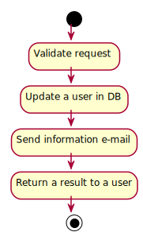
```clojure
(defrecord Request [user-id name email])
```

--

### Motivation - Imperative code

As a user I want to update my name and e-mail address.

```java
string updateNameAndEmail (Request request) {
  validateRequest(request);
  db.updateUser(request);
  mail.sendEmail(request);
  return "Success";
}
```

--

### Motivation - Functional code

As a user I want to update my name and e-mail address.

```clojure
(def update-name-and-email
  (>>= validate-request
       update-user
       send-email
       format-response))
```

--

### Reality


--

### Reality

As a user I want to update my name and e-mail address **and see meaningful error message when something goes wrong**.

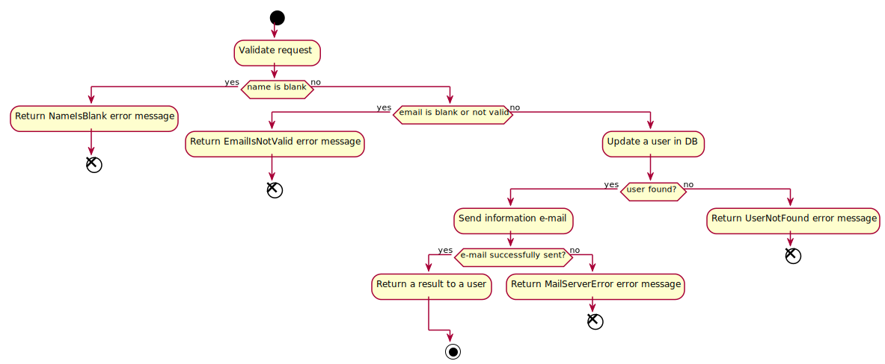

--

### Reality - Imperative code with error handling

```java
string updateNameAndEmail (Request request) {
  boolean isValid = validateRequest(request);
  if (!isValid) {
    return "Invalid request";
  }
  db.updateUser(request);
  mail.sendEmail(request);
  return "Success";
}
```

--

### Reality - Imperative code with error handling

```java
string updateNameAndEmail (Request request) {
  boolean isValid = validateRequest(request);
  if (!isValid) {
    return "Invalid request";
  }
  User user = db.updateUser(request);
  if (user == null) {
    return "User not found";
  }
  mail.sendEmail(request);
  return "Success";
}
```

--

### Reality - Imperative code with error handling

```java
string updateNameAndEmail (Request request) {
  boolean isValid = validateRequest(request);
  if (!isValid) {
    return "Invalid request";
  }
  try {
    User user = db.updateUser(request);
    if (user == null) {
      return "User not found";
    }
  } catch (Exception e) {
    return "DB error";
  }
  try {
    mail.sendEmail(request);
  } catch (Exception e) {
    return "Mail error";
  }
  return "Success";
}
```

An error handling adds 14 lines extra! 200% growth!

--

### Reality - Functional code

```clojure
(def update-name-and-email
  (>>= validate-request
       update-user
       send-email
       format-response))
```

--

### Reality - Functional code with error handling

```clojure
(def update-name-and-email-with-error-handling
  (>>= validate-request
       update-user
       send-email
       format-response))
```

--

### Processing errors in functional way - Design

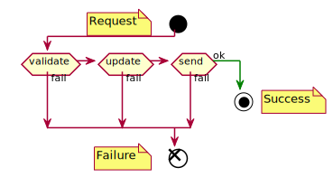

How to bypass a mainstream when a function "fails"?

Type for rescue!

```clojure
(cats.either/right success-data)
(cats.either/left fail-data) ;; e.g. Ring response
```
[https://github.com/funcool/cats](https://github.com/funcool/cats)

--

### Processing errors in functional way - Design


* Each use case function will be equivalent to a single function
* The function returns a sum type "Success" (right) or "Failure" (left)
* The use case function will be built from a series of smaller functions (a step in a flow)

--

### Railway Oriented Programming - Switch

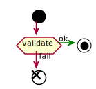

A simple validation function

```clojure
(defn validate
  [input]
  (cond
    (-> input :request :name clojure.string/blank?)
    (cats.either/left {:error "Name must not be blank"})

    (-> input :request :email clojure.string/blank?)
    (cats.either/left {:error "Name must not be blank"})

    :else
    (cats.either/right input)))
```

--

### Railway Oriented Programming - Switch

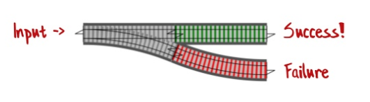

--

### Railway Oriented Programming - Connecting switches

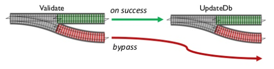

--

### Railway Oriented Programming - Connected switches

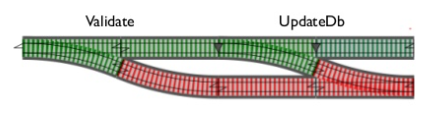

--

### Railway Oriented Programming - Switches

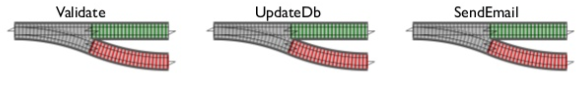

--

### Railway Oriented Programming - Flow as switches


But how to connect them?

--

### Railway Oriented Programming - Composing switches

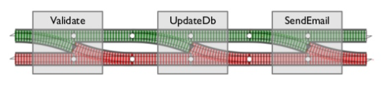

Each box is a switch function

--

### Railway Oriented Programming - Composing one-track


Composing one-track functions fine

--

### Railway Oriented Programming - Composing two-track

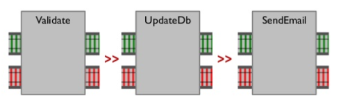

Composing two-track is fine too

--

### Railway Oriented Programming - Composing switches issue

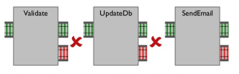

But cannot compose them

--

### Railway Oriented Programming - Building adapter

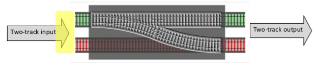

```clojure
(defn adapt
  [input fun]
  (if (cats.either/right? input) ;; <-- success?
    (fun input)
    input))
```
--

### Railway Oriented Programming - Bind


Or we can use **bind** function from cats

```clojure
(cats.core/bind (cats.either/right 1) inc) ;; return 2
```
--

### Railway Oriented Programming - Bind example

```clojure
(defn name-not-blank
  [request]
  (if (-> request :name clojure.string/blank?)
    (cats.either/left {:error "Name must not be blank"})
    (cats.either/right request)))

(defn name-max-length
  [request]
  (if (< 256 (-> request :name count))
    (cats.either/left {:error "Name must not be longer then 255 chars"})
    (cats.either/right request)))

(defn email-not-blank
  [input]
  (if (-> input :request :email clojure.string/blank?)
    (cats.either/left {:error "E-mail must not be blank"})
    (cats.either/right input)))
```

### Railway Oriented Programming - Bind + composition


```clojure
(cats.core/bind
  (cats.either/right request)
  (comp name-not-blank
        name-max-length
        email-not-blank))
```
--

### Railway Oriented Programming - Bind + composition >>=


For better readability (like `->`)
```clojure
(cats.core/>>=
  (cats.either/right request)
  name-not-blank
  name-max-length
  email-not-blank))
```

`>>=` - common symbol for bind

--

### Thank you for your attention

References

* Scott Wlaschin
* [https://fsharpforfunandprofit.com/rop](https://fsharpforfunandprofit.com/rop)
* [https://vimeo.com/113707214](https://vimeo.com/113707214)
* [https://bit.ly/rop-example](https://bit.ly/rop-example) - example

--

### Full example


```clojure
(defn update-name-and-email
  [conf request] ;; <-- Ring request
  (cats.core/extract ;; <-- we want to get wrapped value
   (cats.core/>>=
    (cats.either/right {:conf conf, :request request})
    validate-request
    update-user
    send-email
    format-response))) ;; <-- formatting Ring reqponse
```

`>>=` - common symbol for bind

--
